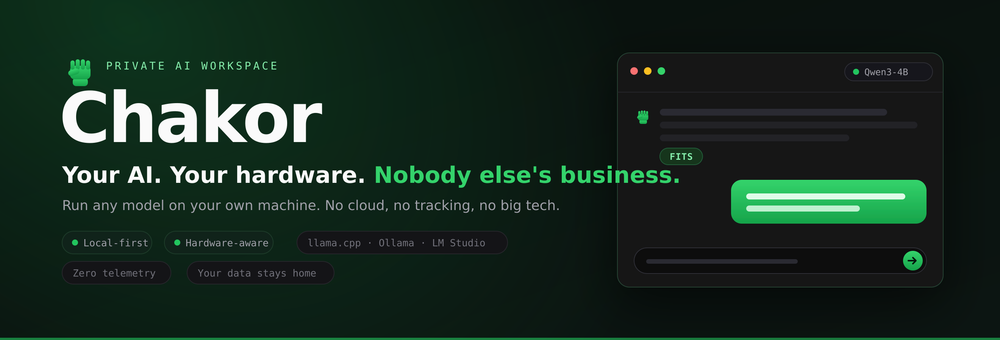
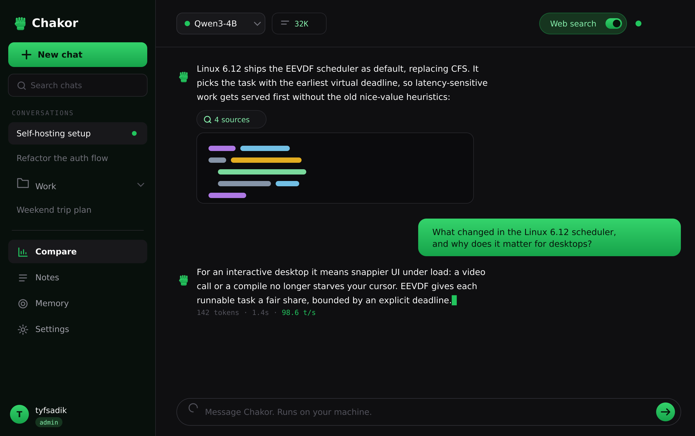
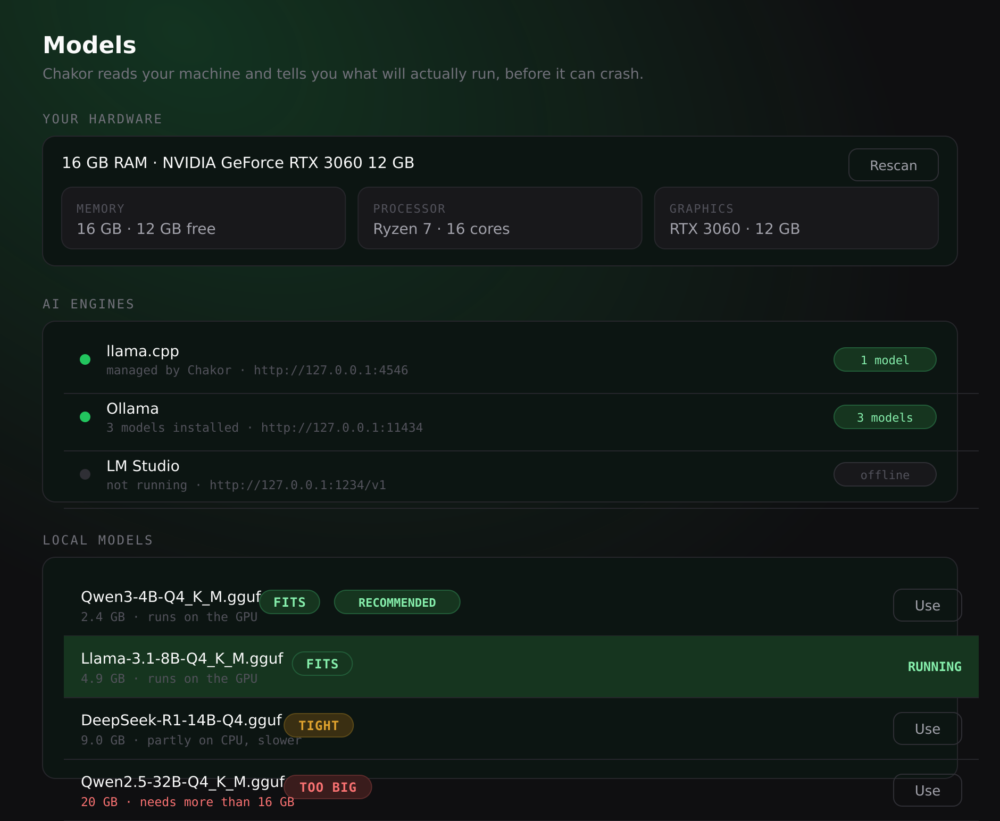
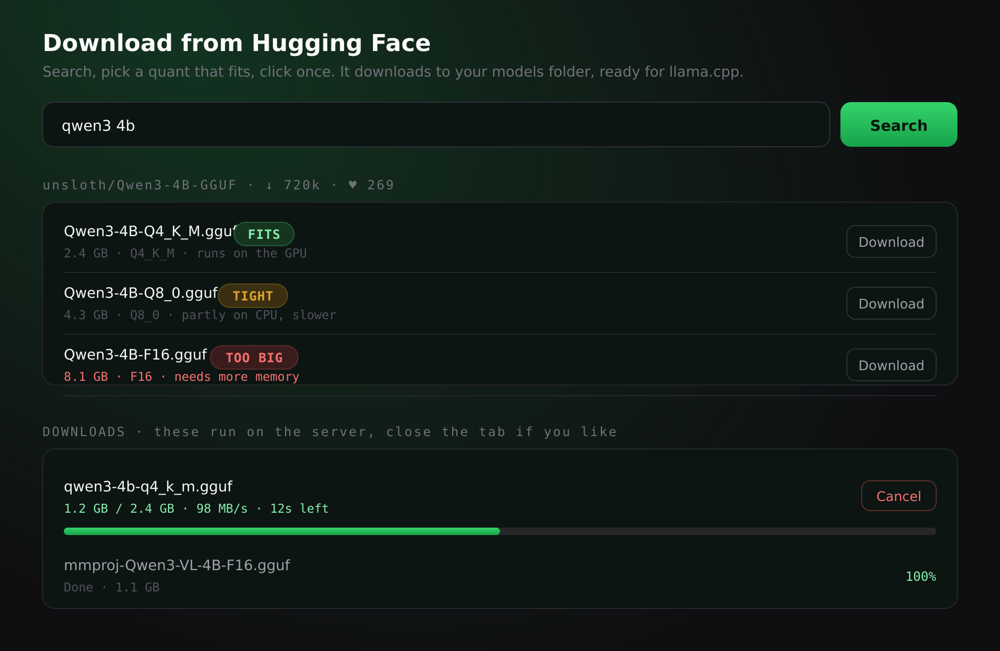

<a id="top"></a>

<div align="center">



<br/>
<br/>

<a href="https://github.com/TYFSADIK/chakor/stargazers"></a>


<br/>
<br/>

**Run any AI model on your own machine. Keep every conversation.**
**No cloud, no tracking, no big tech.**

[Quick start](#quick-start) &nbsp;·&nbsp; [Get a model](#get-a-model) &nbsp;·&nbsp; [Switch models](#switch-models-any-time) &nbsp;·&nbsp; [Features](#everything-it-does) &nbsp;·&nbsp; [On your phone](#use-it-on-your-phone) &nbsp;·&nbsp; [Config](#configuration) &nbsp;·&nbsp; [Develop](#for-developers)

</div>

<br/>

Chakor is an open source AI workspace you run yourself. Point it at a local model or your own API keys, then chat, search the web, talk to your documents, compare models side by side, and run real research. Your conversations live in a database on your machine, not in someone else's data center.

Think of it as a lighter, friendlier alternative to Open WebUI, and an open source answer to LM Studio that also runs on a server and on your phone.

<br/>

<div align="center">



<sub>One workspace: local and cloud models, web search, tools, documents, compare, notes, and memory.</sub>

</div>

<!-- The images above are generated from code in docs/build-assets.mjs so they stay
     on-brand and easy to regenerate. The one thing that beats them is a real 10-second
     screen recording saved as docs/demo.gif at the very top. See docs/README.md. -->

## Why this exists

Every big AI app wants the same deal. You hand over your questions, your documents, your half formed ideas at 2am, and they keep all of it on servers you will never see, to train on, to profile, to sell around. That is the price of "free."

Self hosting flips that. You run the model. You hold the data. No account to harvest, no telemetry phoning home, no data broker in the middle, no government letter they can answer with your chat history because they never had it.

> **Privacy is not a setting you toggle. It is where the software runs.**

Chakor runs on your machine, talks to nobody you did not ask it to, and still tries to be genuinely nice to use. That is the whole pitch.

## Built different

Three things you will not find stitched together anywhere else.

### It knows what your machine can run

Most apps let you download a model, load it, and find out it was too big when it crashes. Chakor reads your RAM and GPU first and tags every model **FITS**, **TIGHT**, or **TOO BIG**, then points you at the best one that actually runs. A 4 GB laptop and a 24 GB workstation each get an honest answer, not a crash.

<div align="center">

</div>

### Get models without touching a terminal

Search Hugging Face from inside the app, see every quant with its size and a fit tag, and click once. It downloads in the background, straight into your models folder, ready for llama.cpp. Close the tab and it keeps going.

<div align="center">

</div>

### Switch engines without the crashes

Flip between llama.cpp, Ollama, and LM Studio in one tap. Chakor unloads the previous model first, so two models never fight for the same VRAM. On a roomy GPU, turn that off and keep several loaded for instant switching.

## Everything it does

**Models, your way**
- ✓ Local models through Ollama, LM Studio, or llama.cpp, on GPU or plain CPU
- ✓ Cloud models with your own keys: OpenAI, Anthropic, Google, OpenRouter
- ✓ Switch model per message, and swap the local model or its context size from the web, no terminal
- ✓ Hardware-aware: Chakor reads your RAM and GPU and tags each local model FITS, TIGHT, or TOO BIG, so you never load one that crashes
- ✓ Download GGUF models from Hugging Face in the app, on a background job with progress and speed you can watch from anywhere
- ✓ Switch engines (llama.cpp, Ollama, LM Studio) from the model menu; it frees the old one first so a modest GPU never OOMs, and points you at a running engine if one is down
- ✓ Load and unload local models and see their size and quant from the model picker

**Knowledge and the web**
- ✓ Web search built in, on per message, with SearXNG then Brave then DuckDuckGo fallback
- ✓ Talk to your files: drop in PDFs, text, or markdown and ask questions grounded in them
- ✓ Real research mode that plans angles, gathers sources, and writes a cited briefing
- ✓ Tools and function calling: web search, fetch a URL, a calculator, the current time

**More than a chat box**
- ✓ Compare: run the same prompt across models side by side, blind, vote, and keep a leaderboard
- ✓ Memory: the assistant remembers facts you want it to, across conversations
- ✓ Notes: a built-in Keep-style notepad with checklists, colors, pinning, and archive
- ✓ Organize: folders, pinning, tags, and archive for your conversations
- ✓ Share a conversation with a link, or import chats you exported elsewhere
- ✓ Image input (vision) on models that support it, attach a picture and ask about it
- ✓ Custom system prompts you can save and reuse

**Yours and private**
- ✓ No telemetry. Conversations stay in a local SQLite database on your disk
- ✓ Multi user with accounts and an admin panel, clean separation between people
- ✓ Theme editor: recolor the whole app live from the settings
- ✓ Rebrand the name, tagline, and look from a config file, no code edits
- ✓ Installable as an app on phone and desktop, built for small screens too

## Chakor vs the usual options

Both Open WebUI and LM Studio are good. Here is where Chakor is different.

| | **Chakor** | Open WebUI | LM Studio |
| --- | :---: | :---: | :---: |
| Open source | ✓ | ✓ | ✗ |
| Self host on a server | ✓ | ✓ | desktop only |
| Run the server on a phone | ✓ Termux | partial | ✗ |
| Local models (Ollama / llama.cpp) | ✓ | ✓ | ✓ |
| One UI for llama.cpp + Ollama + LM Studio | ✓ | partial | ✗ |
| Knows your hardware, fit tag per model | ✓ | ✗ | partial |
| Download GGUF from Hugging Face in-app | ✓ | ✗ | ✓ |
| Background downloads you can walk away from | ✓ | ✗ | ✓ |
| Frees the old model so you don't OOM on switch | ✓ | ✗ | n/a |
| Bring your own cloud keys | ✓ | ✓ | limited |
| Swap local model + context from the UI | ✓ | partial | ✓ |
| Web search built in | ✓ | ✓ | ✗ |
| Chat with your documents | ✓ | ✓ | beta |
| Multi user + admin panel | ✓ | ✓ | ✗ |
| Blind A/B model compare + leaderboard | ✓ | partial | ✗ |
| Notes + assistant memory | ✓ | partial | ✗ |
| Rebrand from one config file | ✓ | ✗ | ✗ |
| One small codebase you can read | ✓ | heavy | closed |

## Quick start

Pick whichever fits you. All three end with the app on **http://localhost:3001**. The first account you register becomes the admin.

> The default `.env` ships with `REGISTRATION_MODE=invite` and `INVITE_CODE=change-me`. For a solo setup, set `REGISTRATION_MODE=open` before you register, or just use the invite code on the register screen. Either way, account number one is the admin.

### Option 1: Docker (Linux, macOS, Windows)

The least fuss. Install Docker Desktop or Docker Engine, then:

```bash
git clone https://github.com/TYFSADIK/chakor.git && cd chakor
docker compose up -d
```

That is it. A secret key is generated for you and stored in the data volume. Want a local model bundled in too:

```bash
docker compose --profile ollama up -d
docker compose exec ollama ollama pull llama3.2
```

### Option 2: One command installer (Linux, macOS, Android)

No Node installed? These scripts handle that for you, then set everything up and start it.

```bash
git clone https://github.com/TYFSADIK/chakor.git && cd chakor
bash install.sh
```

On **Windows**, open PowerShell in the folder and run:

```powershell
powershell -ExecutionPolicy Bypass -File install.ps1
```

On **Android**, install [Termux](https://termux.dev), then run the same `bash install.sh`. It uses Termux packages automatically, and your phone becomes the server.

### Option 3: Manual (for developers)

```bash
git clone https://github.com/TYFSADIK/chakor.git && cd chakor
npm install --legacy-peer-deps
cp .env.example .env.local            # then set AUTH_SECRET (openssl rand -base64 32)
npm run build
npm start
```

## Get a model

Chakor needs something to talk to. Easiest options, in order:

1. **Ollama (recommended).** Install it from [ollama.com](https://ollama.com), then pull a model:
   ```bash
   ollama pull llama3.2
   ```
   Chakor finds installed Ollama models on its own and lists them in the model picker. This is the simplest way to "run any model."

2. **LM Studio.** Already use LM Studio? Open its **Developer** tab and **Start Server**. Chakor talks to it at `http://127.0.0.1:1234/v1` (override with `LMSTUDIO_BASE_URL`) and the models you have loaded there appear in the picker automatically, the same as Ollama.

3. **llama.cpp + download from Hugging Face.** Point `LLAMA_SERVER_BIN` at your `llama-server` and Chakor runs it for you as part of the same service. No model yet? In **Settings → Models → Download from Hugging Face**, search for one, see every quant with its size and a fit tag for your machine, and download it with a progress bar straight into your models folder, no terminal. Or drop `.gguf` files in `~/Downloads`, `~/models`, or `~/.lmstudio` (or set `CHAKOR_MODELS_DIR`) yourself. Already run your own `llama-server`? Set `LLAMA_BASE_URL` and `CHAKOR_SUPERVISE_LLAMA=false` and Chakor just uses it.

4. **Cloud keys.** Paste a key into `.env.local` and that provider's models show up:
   `OPENAI_API_KEY`, `ANTHROPIC_API_KEY`, `GOOGLE_AI_API_KEY`.

5. **OpenRouter.** One key for hundreds of models, including the big ones. Set `OPENROUTER_API_KEY` and list the models you want in `OPENROUTER_MODELS`.

Not sure what your machine can handle? **Settings → Models** shows your detected RAM and GPU and marks each local model FITS, TIGHT, or TOO BIG, with a RECOMMENDED pick. Start there and you won't load something that just crashes.

## Switch models any time

This is the part people usually have to fight a terminal for. In Chakor it is all in the UI.

- **Per message.** Click the model name in the chat header and pick any model you have set up, local or cloud. Your choice sticks to that conversation.
- **Switch engines from the menu.** The model menu has a row for llama.cpp, Ollama, and LM Studio with a live running light and model count. Tap one to move your whole stack to it. If the engine you are on crashed or isn't up, it points you at a running one, so you are never stuck on a dead backend.
- **One model at a time, automatically.** Switching engines unloads the previous model first, so two models never fight over the same VRAM and crash. Got a roomy GPU? Flip on "keep multiple models loaded" in **Settings → Models** for instant switching. On a modest machine it stays safely one-at-a-time.
- **Download in the background.** A Hugging Face download runs on the server, not in your browser, so you can close the tab and it keeps going. A chip in the chat header shows progress, speed, and time left, and lets you cancel from anywhere.
- **Swap the local model live.** Go to **Settings → Models**. Chakor lists every `.gguf` it found on your machine, each tagged with how well it fits your hardware. Click one and it loads, no editing config files, no restart in the terminal. The change is an in process restart of the bundled `llama-server`, so it just happens.
- **Change the context size.** Same screen. It maps to a real `num_ctx` for Ollama, a server reload for the local model, and a history budget for cloud models, so the number means something everywhere. **Max** loads at the biggest window your hardware can back.
- **Vision turns on by itself** when the running local model supports images, and the attach button appears.
- **Add a cloud key without redeploying.** Each user can paste their own API keys under **Settings**, so a key is per person, not baked into the server.
- **Load and unload** local models and read their size and quant straight from the picker (admin only for load and unload).

## Use it on your phone

Two ways:

- **From any phone on your network.** Open the server address in your phone browser, then use "Add to Home Screen." It installs like a normal app, full screen, no browser bars.
- **On the phone itself.** Install [Termux](https://termux.dev) and run `bash install.sh`. Your phone becomes the server.

## Configuration

Everything lives in `.env.local`. The ones you will actually touch:

| Setting | What it does |
| --- | --- |
| `AUTH_SECRET` | Required. Signs login sessions. Generate with `openssl rand -base64 32`. |
| `REGISTRATION_MODE` | `open`, `invite`, or `closed`. With `invite`, also set `INVITE_CODE`. |
| `OLLAMA_BASE_URL` | Where Ollama runs. Default is fine for a local install. |
| `LMSTUDIO_BASE_URL` | Where LM Studio's server runs. Default `http://127.0.0.1:1234/v1`. Loaded models appear automatically. |
| `LLAMA_SERVER_BIN`, `LLAMA_GGUF` | llama.cpp binary plus the default model Chakor runs for you. Switch both live in Settings → Models. |
| `CHAKOR_MODELS_DIR`, `CHAKOR_SUPERVISE_LLAMA` | Extra folders to scan for `.gguf` files. Set supervise to `false` to run llama-server yourself. |
| `CHAKOR_LLAMA_MAX_CRASHES` | How many fast crashes before Chakor stops relaunching a too-big model and tells you to pick a smaller one. Default 4. |
| `HF_TOKEN` | Optional Hugging Face token for the in-app downloader. Lifts rate limits and reaches gated repos. Public models need none. |
| `OPENAI_API_KEY`, `ANTHROPIC_API_KEY`, `GOOGLE_AI_API_KEY` | Turn on cloud models. |
| `OPENROUTER_API_KEY`, `OPENROUTER_MODELS` | One key, many models. List them as `id\|Label`, comma separated. |
| `SEARXNG_URL`, `BRAVE_SEARCH_API_KEY` | Web search backends. |
| `NEXT_PUBLIC_APP_NAME`, `NEXT_PUBLIC_APP_TAGLINE`, `APP_CREATOR` | Rebrand the app. |

### Make it yours

Set these and rebuild, and the name shows up everywhere from the sidebar to the browser tab to the assistant's own answers:

```bash
NEXT_PUBLIC_APP_NAME="Acme AI"
NEXT_PUBLIC_APP_TAGLINE="Our team's private assistant."
APP_CREATOR="Your Name"
```

Swap the logo by replacing `public/logo.svg` and the icons in `public/`. Want different colors without touching code? Open the **theme editor** in settings and recolor the app live.

## For developers

- **Stack:** Next.js 15, React 19, TypeScript, Tailwind, SQLite via better-sqlite3, Auth.js v5.
- **Where things live:**
  - Assistant behavior and personality: `lib/system-prompt.ts` (plain English, edit away)
  - Model providers and streaming: `lib/providers.ts`, `lib/dispatch.ts`, `lib/models.ts`
  - Local llama.cpp supervisor: `lib/llama-supervisor.ts`, `lib/local-llama.ts`
  - Tools and the agent loop: `lib/tools.ts`, `lib/agent.ts`
  - Web search: `lib/searxng.ts`
  - Document retrieval: `lib/rag.ts`
  - Theme tokens: `lib/theme.ts`
  - Database: `lib/db.ts` (schema self creates on first run)
  - Branding and config: `lib/config.ts`
- **Add a model provider:** add a `stream*` function in `lib/providers.ts`, register it in `lib/models.ts`, and route it in `app/api/chat/route.ts`. The existing providers are short and copy friendly.
- **Run for development:** `npm run dev` (hot reload on port 3001).
- Before a pull request, run `npm run build` so it type checks. See [CONTRIBUTING.md](CONTRIBUTING.md).

## How it works

```
Browser  (app/, components/)
  |
  v
Next.js app
  |
  +-- /api/chat ---> lib/system-prompt.ts     how the assistant behaves
  |                  lib/dispatch.ts           routes to the right provider + trims context
  |                  lib/providers.ts          ollama, openai, anthropic, google, openrouter
  |                  lib/llama-supervisor.ts   runs local llama.cpp as a child process
  |                  lib/agent.ts + tools.ts   function calling loop
  |                  lib/searxng.ts            web search, with fallbacks
  |                  lib/rag.ts                document retrieval
  |
  +-- lib/db.ts ---> SQLite  (your data, on your disk)
```

## Running it 24/7

There is a systemd unit at `scripts/chakor.service`. Edit the paths inside, then:

```bash
sudo cp scripts/chakor.service /etc/systemd/system/
sudo systemctl daemon-reload
sudo systemctl enable --now chakor
```

Already had the old two service setup (a separate llama server)? Run `scripts/use-single-service.sh` once to fold it into one. Or just leave the Docker container running, it restarts itself.

## FAQ

**Do I need a GPU?** No. CPU works, just slower. Or use a cloud key and run nothing locally.

**Is my data sent anywhere?** No, unless you turn on web search or pick a cloud model. Then only those requests go out, and only to the provider you chose.

**Can I change the model mid conversation?** Yes. Pick a different one from the header and the next message uses it. See [Switch models any time](#switch-models-any-time).

**Answers too long or too short?** Edit `buildSystemPrompt()` in `lib/system-prompt.ts`. It is written in normal language.

**How is this different from Open WebUI or LM Studio?** It is lighter than Open WebUI and simpler to run, it is open source unlike LM Studio, and it runs anywhere including a phone. It is also openly opinionated about privacy and self hosting. See [the table](#chakor-vs-the-usual-options).

## Troubleshooting

| Problem | Fix |
| --- | --- |
| `npm install` fails on peer deps | Use `npm install --legacy-peer-deps`. |
| Chat says it cannot connect | Is Ollama, LM Studio, or llama.cpp running, or did you set a cloud key. The model menu and Settings → Models both show which engines are up. |
| Local model keeps crashing | It is probably too big for your machine. Settings → Models marks it TOO BIG and suggests one that fits, or switch to Ollama or LM Studio from the model menu. |
| No models in the picker | Pull a model with `ollama pull`, load one in LM Studio, or add an API key, then reload. |
| Search finds nothing | Turn on `json` format in SearXNG, or set `BRAVE_SEARCH_API_KEY`. |
| Cannot sign in after first run | First account registered is the admin. Check `REGISTRATION_MODE` and `INVITE_CODE`. |

## Contributing

Pull requests are welcome. Keep the voice human (no emoji, no em dashes), run `npm run build` before you open one, and see [CONTRIBUTING.md](CONTRIBUTING.md) for the rest.

If Chakor is useful to you, **star the repo**. It is the single easiest way to help other people find a private alternative to the big AI apps.

## License

MIT. Do what you want with it. See [LICENSE](LICENSE).

<br/>

<div align="center">

### Your AI should answer to you, not to a data broker.

Run it on your laptop. Run it on a server. Run it on your old phone in a drawer. Keep every word.

<a href="#quick-start"></a>
&nbsp;
<a href="https://github.com/TYFSADIK/chakor"></a>

<br/>
<br/>

**Built for people who would rather run their own tools.**

<sub>No cloud · No tracking · No big tech · <a href="#top">back to top</a></sub>

</div>
